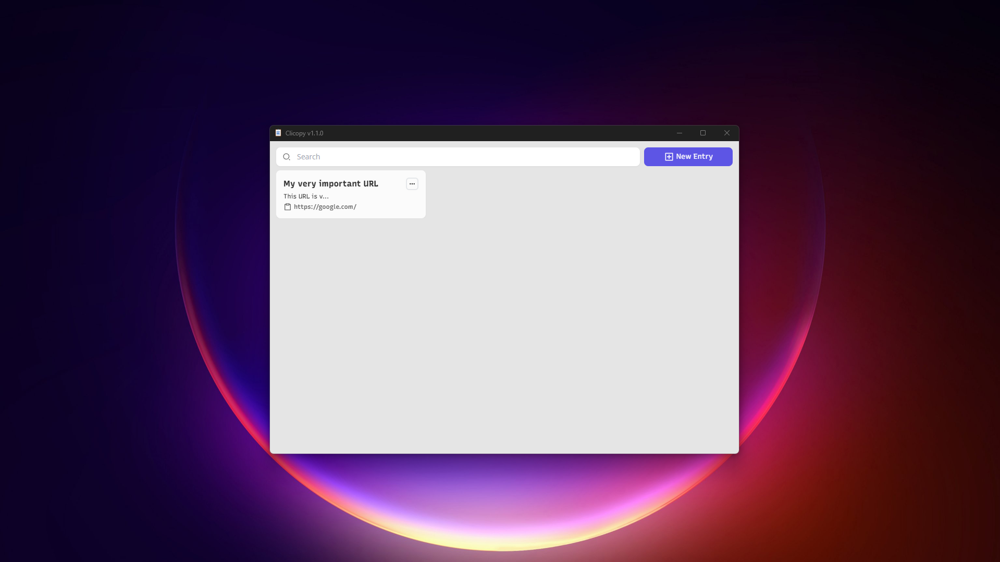
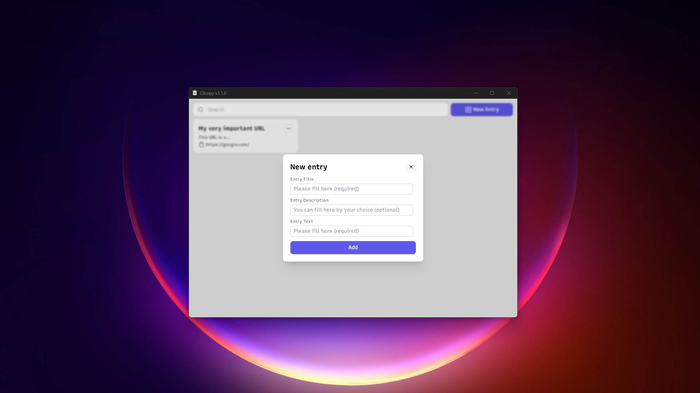
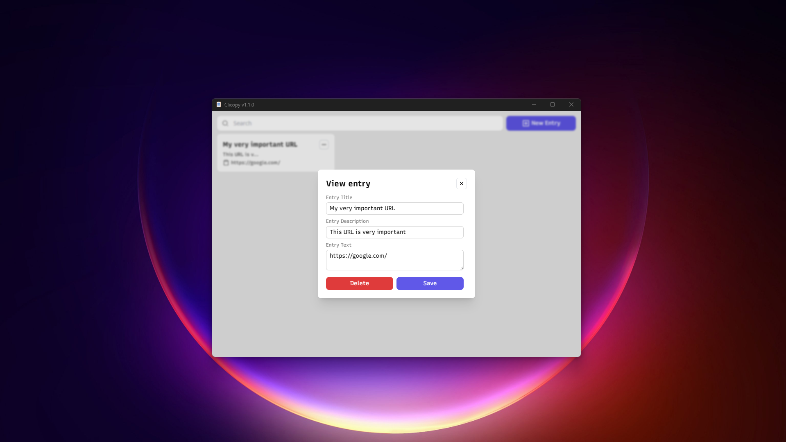

# Clicopy

[](https://opensource.org/licenses/MIT)
[](https://tauri.app/)
[](https://solidjs.com/)
[](https://www.rust-lang.org/)

A modern desktop application for managing and quickly copying frequently used text snippets. Built with Tauri, SolidJS, and Rust for optimal performance and cross-platform compatibility.

## 📸 Screenshots


_Main interface showing saved text entries_


_Adding a new text entry with name and description_


_Editing an existing text entry_

## ✨ Features

- 📝 **Text Management**: Save frequently used text snippets with custom names and descriptions
- 📋 **One-Click Copy**: Single click to copy text to clipboard, double click to view/edit
- 🗃️ **Local Database**: All data stored locally using SQLite for privacy and offline access
- ✏️ **Full CRUD Operations**: Create, read, update, and delete text entries
- 🔍 **Search Functionality**: Quickly find your saved text snippets
- 🌐 **Multilingual Support**: Supports both Persian and English languages
- 🎨 **Modern UI**: Clean, responsive interface built with TailwindCSS
- ⚡ **Fast Performance**: Native performance thanks to Tauri and Rust backend

## 🛠️ Tech Stack

- **Frontend**: SolidJS, TypeScript, TailwindCSS
- **Backend**: Rust, Tauri
- **Database**: SQLite with Rusqlite
- **Build Tool**: Vite
- **Package Manager**: Bun (recommended) or npm

## 📋 System Requirements

- **Operating System**: Windows, macOS, or Linux
- **Node.js**: Version 16 or higher
- **Rust**: Latest stable version
- **Bun**: Latest version (recommended) or npm

## 🚀 Installation & Setup

### Prerequisites

1. Install [Node.js](https://nodejs.org/) (v16+)
2. Install [Rust](https://rustup.rs/)
3. Install [Bun](https://bun.sh/) (recommended) or use npm

### Development Setup

1. **Clone the repository**

   ```bash
   git clone https://github.com/erfan114/clicopy.git
   cd clicopy
   ```

2. **Install dependencies**

   ```bash
   # Using Bun (recommended)
   bun install

   # Or using npm
   npm install
   ```

3. **Run in development mode**

   ```bash
   # Using Bun
   bun tauri dev

   # Or using npm
   npm run tauri dev
   ```

### Building for Production

```bash
# Using Bun
bun tauri build

# Or using npm
npm run tauri build
```

The built application will be available in `src-tauri/target/release/bundle/`.

## 🎯 Usage

1. **Adding Text Entries**: Click the "New Entry" button to add a new text snippet with a name and description
2. **Copying Text**: Single-click any entry card to instantly copy its text to your clipboard
3. **Viewing/Editing**: Double-click an entry to view details or edit the content
4. **Searching**: Use the search bar to quickly find specific entries
5. **Managing Entries**: Edit or delete entries through the context menu or detail view

## 🗺️ Roadmap

- ⬜ **Application Settings**: Language preferences, theme selection, database location
- ⬜ **Image Support**: Add images to text entries
- ⬜ **Import/Export**: Backup and restore functionality
- ⬜ **Keyboard Shortcuts**: Quick access hotkeys
- ⬜ **Categories/Tags**: Organize entries with categories
- ⬜ **Cloud Sync**: Optional cloud synchronization

## 🤝 Contributing

Contributions are welcome! This is a learning project built with Tauri and SolidJS, so please be constructive with feedback.

1. Fork the repository
2. Create a feature branch (`git checkout -b feature/amazing-feature`)
3. Commit your changes (`git commit -m 'Add some amazing feature'`)
4. Push to the branch (`git push origin feature/amazing-feature`)
5. Open a Pull Request

## 📄 License

This project is licensed under the MIT License - see the [LICENSE](LICENSE) file for details.

## 🙏 Acknowledgments

> [!TIP]
> Special thanks to [@sajjadcnr12](https://github.com/sajjadcnr12) for inspiring this project!

## 📞 Support

If you encounter any issues or have questions, please [open an issue](https://github.com/erfan114/clicopy/issues) on GitHub.
